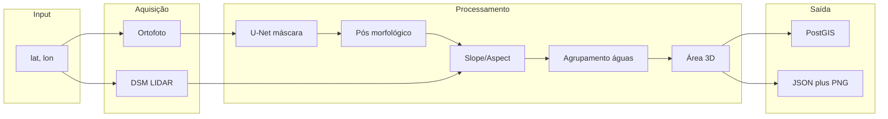

# Arquitetura do Sistema

## Visão geral

A Roof API é uma API geoespacial que analisa telhados a partir de coordenadas (lat/lon): adquire ortofoto e DSM LIDAR, segmenta o telhado com U-Net, calcula águas por slope/aspect, áreas 3D e persiste em PostGIS.

## Diagrama de fluxo

## Módulos

| Módulo | Responsabilidade |
|--------|-------------------|
| `api` | Rotas FastAPI, schemas Pydantic, validação |
| `core` | Configuração, logging |
| `db` | SQLAlchemy, PostGIS (telhados, aguas_telhado) |
| `geo` | Bounds a partir de ponto, aquisição de ortofoto |
| `lidar` | Obtenção de DSM (DGT/PNOA), fallback |
| `segmentation` | U-Net, pós-processamento morfológico, máscara binária |
| `aguas` | Slope/aspect, agrupamento, vetorização, área 3D |
| `visualization` | Geração de PNG (base + máscara + águas + labels) |
| `services` | Orquestrador, cache, image store |

## Dados

- **Entrada:** latitude, longitude (WGS84).
- **Persistência:** PostgreSQL + PostGIS; tabelas `telhados` (ponto, bounds, área, fonte LIDAR) e `aguas_telhado` (polígono, área, inclinação, azimute).
- **Saída:** JSON estruturado + URL/base64 da imagem PNG.

## Dependências externas

- Ortofoto: URL de tiles ou WMS (configurável).
- LIDAR: ficheiros ou serviços DSM para Portugal (DGT) e Espanha (PNOA).
- Modelo U-Net: ficheiro de pesos (opcional; sem modelo usa heurística).
